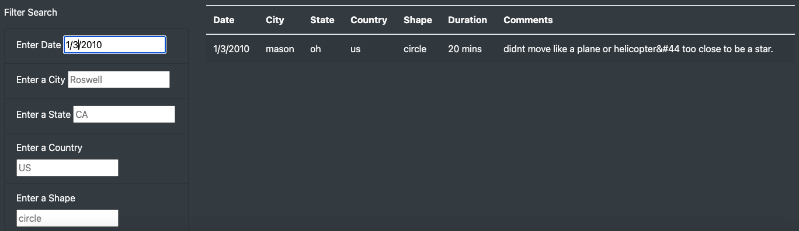
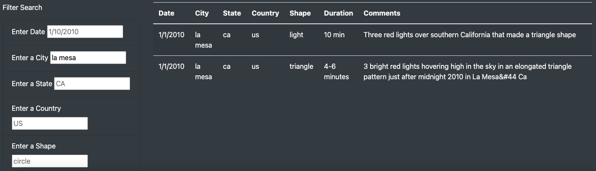
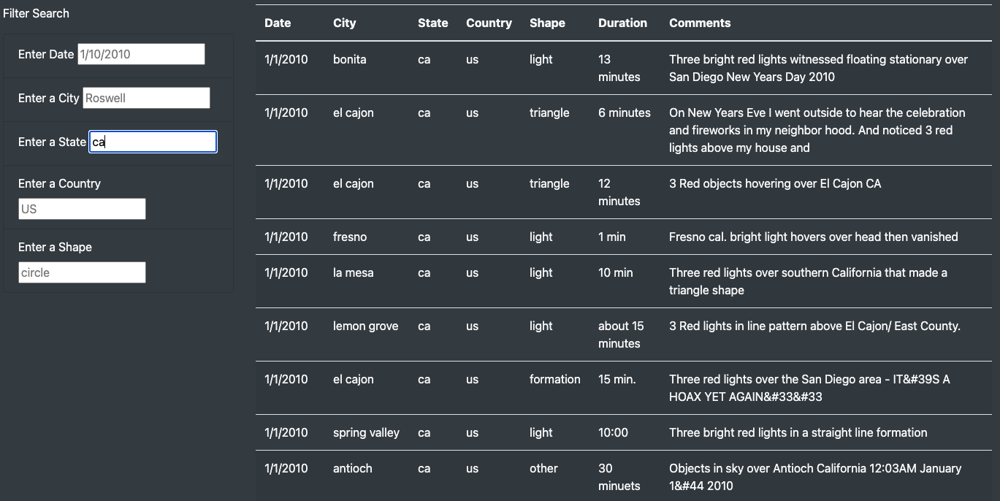
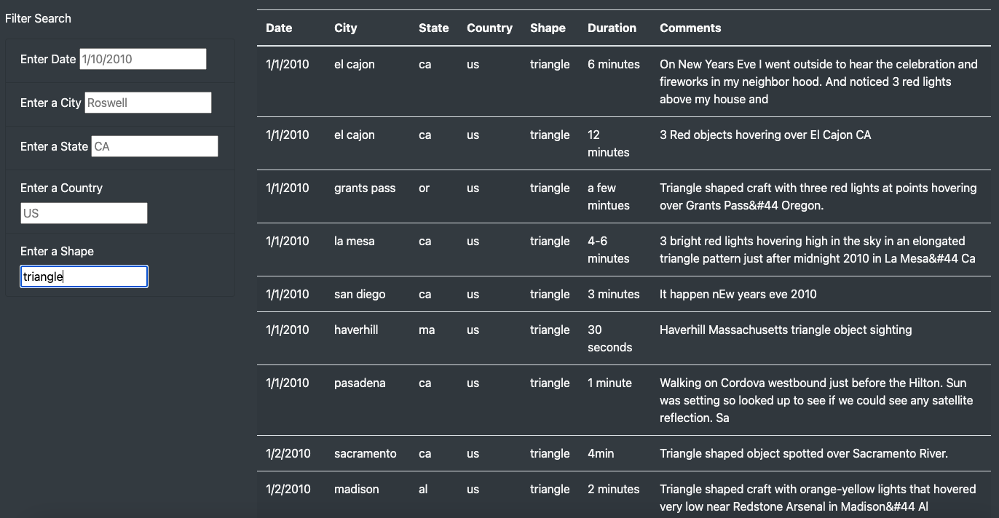

# UFO Sightings

## Overview
### UFO sightings: fact or fancy?
Are we alone in the universe? For millennia, humans have turned to the sky to answer this question. Now, thanks to research generously funded by W. Avy, a UFO-enthusiast and amateur ufologist, we can supplement our sky-searching with data analysis.

### What do you think?
Are aliens trying to contact us, or do they want to be left alone? Through this UFO Sightings webpage and dynamic table you can filter the data by multiple criteria including date, city, state, country and shape. So dig through the data and let us know what you see.

## Results
### Searching for the answers
A skeptic can't deny the data! In the provided filter search fields, you can search by one or all criteria. Following are examples of searching by just one criteria.

* Searching by date, showing results for 1/3/201

* Searching by city, showing results for La Mesa

* Searching by state, showing results for CA

* Searching by shape, showing results for triangle

For brevity I've only shared these four images, but once you start filtering searches the possibilities are endless. There is lots of fun to be had with this UFO Sightings webpage and dynamic table.

## Summary
### UFO sightings: to investigate or leave alone?
Not everyone is ready to celebrate UFO Sightings data. Local CEO and vocal anti-alien activist V. Isualize reached out to our reporters to go on record as firmly opposed to any attempts to provide access to this data. "If there are aliens, they certainly would like to be left alone," she stated, before directing us to the Leave Aliens Alone (LAA) community engagement initiative she founded and funds.

A drawback to creating the UFO Sightings website is the controversy. For every UFO enthusiast there is a skeptic and another who wants to let this potential life form exist without disruption. 

Two additional recommendations for further development on UFO sighting webpage development are gathering more data and adding supporting articles and research. To increase the data set, I would consider adding a form to the webpage for people to add their own findings. Additionally, expanding the webpage to scrape the latest articles from popular UFO websites would substantiate the UFO Sightings as the place to go to debate UFO sightings: fact or fancy?